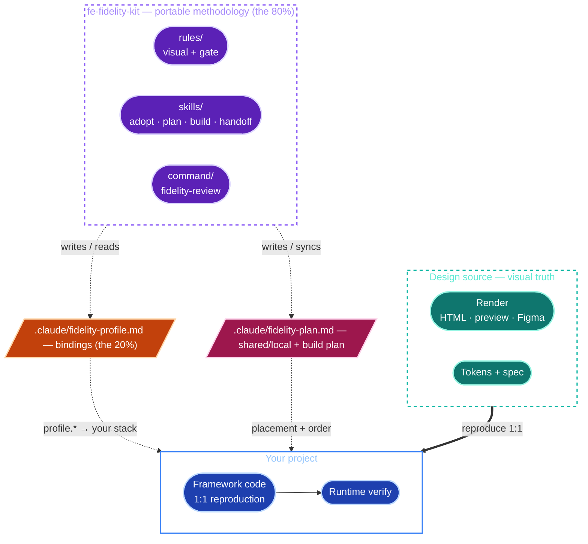
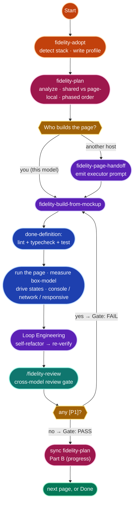

<div align="center">

# fe-fidelity-kit

**Reproduce a design mockup into frontend code at 1:1 fidelity — gated by a cross-model executor/reviewer review.**

A stack-neutral toolkit for [Claude Code](https://claude.com/claude-code) (and any Claude Agent SDK host). The *methodology* is portable; the *per-project bindings* live in one file.

`English` · [简体中文](README.zh.md)


</div>

---

## What it is

Reproducing a mockup into real frontend code "looks done" long before it *is* done. The last mile — the icons, the fonts, the exact box-model, the hover states — is where 1:1 fidelity quietly dies, and a single screenshot won't catch it.

**fe-fidelity-kit** distills a reproduction methodology that is **~80% framework-agnostic** and pushes the **~20% that is stack-specific** (framework, UI lib, styling, icons, token source, paths, commands, runtime tool, mockup source) into a **single per-project profile**. You adopt it once, reproduce pages against a disciplined checklist, and ship only what clears a **cross-model review gate**.

The portable 80% in one breath:

> *The rendered output is visual truth (not the spec text) · native-component-first · map design tokens by **value** not by **name** · the five disaster zones (icons / fonts / generated-visuals / container box-model / interactive states) · **measure** the box-model, don't eyeball it · AHA component placement · an executor×reviewer gate with `[P1]/[P2]` → `PASS/FAIL`.*

---

## Table of contents

- [The three ideas](#the-three-ideas)
- [Architecture](#architecture)
- [The workflow](#the-workflow)
- [The build plan](#the-build-plan)
- [The review gate](#the-review-gate)
- [The five disaster zones](#the-five-disaster-zones)
- [Quickstart](#quickstart)
- [What's in the box](#whats-in-the-box)
- [The profile — the 20%](#the-profile--the-20)
- [Memory / Harness Interop](#memory--harness-interop)
- [Capability ladder](#capability-ladder)
- [Caveats that cap the gate](#caveats-that-cap-the-gate)
- [How it stays portable *and* concrete](#how-it-stays-portable-and-concrete)
- [FAQ](#faq)
- [Contributing](#contributing)
- [License](#license)

---

## The three ideas

1. **The rendered output is visual truth — not the spec text.** The most common way reproduction goes wrong is reading the ticket and *imagining* the result. Open the actual render and look; when the spec and the render disagree, the render wins.
2. **80% portable methodology, 20% per-project binding.** The discipline never changes between projects. The stack does. So the kit keeps the discipline stack-neutral and confines every concrete name (framework, UI lib, icon package, token file, run commands…) to `.claude/fidelity-profile.md`.
3. **One model builds, a *different* model reviews.** A model auditing its own output shares its own blind spots. Cross-model review's blind spots don't overlap — that is where the gate's value comes from. The verdict is machine-parseable: `[P1]` (must-fix → FAIL) / `[P2]` (suggestion) → `Gate: PASS | FAIL`.

---

## Architecture

The kit is a **stack-neutral methodology** (rules + skills + a command) that **binds to your project through one profile file**. The design source is the visual truth on one side; your project is the reproduction on the other; the profile is the bridge that resolves every generic `profile.*` reference to your real stack.



Because the methodology files never hardcode a stack — they cite `profile.<field>` and resolve it at runtime against `.claude/fidelity-profile.md` — the same kit works for Next + AntD, Vite + Tailwind + Radix, Remix, Astro, Nuxt, or whatever you bring.

---

## The workflow

**Adopt once, plan the build once, then for each page: reproduce → verify → gate.** You can build a page yourself (the model is the executor) or hand it to a *different* host (e.g. Codex) and orchestrate.



| Phase | Skill / command | What happens |
|---|---|---|
| **Adopt** | `fidelity-adopt` | Detects your stack (framework, UI lib, styling, icons, token source, placement dirs, mockup location, runtime tool), asks only the gaps, writes `.claude/fidelity-profile.md` + an idempotent pointer in `CLAUDE.md`. Non-destructive, re-runnable. |
| **Plan** | `fidelity-plan` | *(multi-page)* Surveys the whole mockup → design patterns, the **shared vs page-local** component inventory, and a phased build order → `.claude/fidelity-plan.md` with a living progress tracker. |
| **Reproduce (you)** | `fidelity-build-from-mockup` | You are the executor: pull the source, look at the render, map native components, walk the five disaster zones, place per AHA, then the done-definition. |
| **Reproduce (hand off)** | `fidelity-page-handoff` | Emits a ready-to-paste prompt that hands the page to a different model/host as the executor — with the spec slice, done-definition, Loop Engineering, and gate handshake pre-filled. |
| **Verify** | *(executor)* | `lint + typecheck + test` green, then **actually run the page**: load + screenshot, measure the box-model, drive interactive states, check console/network/responsive. Keep the evidence. |
| **Loop Engineering** | *(executor)* | One self-refactor pass to the simplest shape — behavior and rendered result must not change — then re-run the entire done-definition. |
| **Gate** | `/fidelity-review` *(or `fidelity-page-handoff` Template C → another host)* | A read-only reviewer (ideally a different model) audits the diff + evidence and emits `[P1]/[P2]` → `Gate: PASS | FAIL`. |

---

## The build plan

For a multi-page mockup, **`fidelity-plan` runs once before any page is built.** It surveys the *whole* mockup and writes `.claude/fidelity-plan.md`:

- **Design patterns** — the recurring shells, blocks, and interactions; what maps to a native component vs what is genuinely hand-built.
- **Shared vs page-local components** — every recurring component is classified by its **actual cross-page usage**: used on ≥2 pages (or guarding a cross-module invariant) → **shared**; used once → **page-local**. This is AHA (Avoid Hasty Abstractions) applied by *survey* — the Nth use is *detected* up front, not speculated — so you neither duplicate near-identical components nor pre-generalize single-use ones.
- **A phased build order** — engineering base → app shell + global shared primitives → pages, *grouped so pages that share a component land in the same phase* and the shared piece converges once.
- **A living progress tracker** — after each page clears the gate, the build loop updates the page/component status, the real verification log, and the next slice; a page-local component is promoted to shared the moment its real 2nd use appears. Drift between plan and code is a `/fidelity-review` finding.

Single page or a quick one-off? Skip it and go straight to `fidelity-build-from-mockup`.

---

## The review gate

This is the heart of the kit. **One model writes; a different model picks holes.** The executor is responsible for everything a static review *can't* see (does it run? does it overflow? are the box-model numbers right?); the reviewer is responsible for the things a builder is blind to in its own work.

```mermaid
flowchart LR
    classDef exec fill:#5b21b6,stroke:#ddd6fe,stroke-width:2px,color:#fff
    classDef rev fill:#0f766e,stroke:#99f6e4,stroke-width:2px,color:#fff
    classDef decision fill:#a16207,stroke:#fde68a,stroke-width:2px,color:#fff
    classDef success fill:#047857,stroke:#a7f3d0,stroke-width:2px,color:#fff
    classDef fail fill:#b91c1c,stroke:#fecaca,stroke-width:2px,color:#fff

    subgraph Exec["Executor — writes code · runs the page"]
        direction TB
        E1(["build the page"]):::exec --> E2(["run it · capture evidence<br/>screenshots · box-model · console"]):::exec --> E3(["Loop Engineering"]):::exec
    end

    subgraph Rev["Reviewer — read-only · a different model"]
        direction TB
        R1(["audit diff + evidence"]):::rev --> R2(["tag findings<br/>[P1] must-fix · [P2] suggest"]):::rev
    end

    E3 ==>|"submit diff + evidence"| R1
    R2 --> D{{"any [P1]?"}}:::decision
    D -->|"no"| Pass(["Gate: PASS → merge"]):::success
    D -->|"yes"| Fail(["Gate: FAIL<br/>→ back to executor"]):::fail

    style Exec fill:none,stroke:#8b5cf6,stroke-width:2px,stroke-dasharray:5 5,color:#a78bfa
    style Rev fill:none,stroke:#14b8a6,stroke-width:2px,stroke-dasharray:5 5,color:#5eead4
```



| | **Executor** | **Reviewer** |
|---|---|---|
| Who | the model/host that writes code (Claude, Codex, any) | a **different** model/host, read-only |
| Owns | writes code; runs lint/typecheck/test; **runs the page**; measures box-model, drives states, checks console/network/responsive; attaches evidence | audits diff, behavior risk, edge/failure paths, test weakness; for UI, audits style-match signals from code + the executor's screenshots; emits the verdict |
| Does **not** | self-judge the gate verdict | run the page or edit code |

The executor's evidence isn't loose screenshots — it follows a naming contract (`<route>-<state>-<viewport>.png`, `<route>-box.txt`, `<route>-console.txt`) under `profile.verify.evidence_dir`, so a reviewer finding can cite a file the way code cites `file:line`. See [`fidelity-gate.md`](rules/fidelity-gate.md).

**Verdict rules**

- `[P1]` = **must-fix → FAIL.** Spec/behavior drift, swallowed errors, missing edge paths, tautological tests, broken interfaces, races — **and visual drift that breaks the current UI goal** (icon set swapped, heading font fell back to system, generated-visual structure off, box-model drift).
- `[P2]` = **suggestion → follow-up.** Doesn't block — *unless* it breaks the current UI goal, then it's promoted to `[P1]`.
- **No `[P1]` ⇒ PASS.** The report ends with exactly two machine-parseable lines:
  ```
  Gate: PASS | FAIL
  Recommendation: <one concrete action> because <the single most important finding>
  ```

> **A reviewer PASS never means "the page renders right."** Runtime layout/overflow/console/box-model are the executor's job and a *precondition* of PASS — see [Caveats](#caveats-that-cap-the-gate) for the single-model, measurement-incapable, and state-undrivable degradations.

---

## The five disaster zones

These are where 1:1 reproduction dies. Zones 1–3 are "swapped the wrong thing"; Zone 4 is "looks right, off by 4–8px" (the most insidious); Zone 5 is "looks right, behaves wrong" (invisible in one static screenshot).

| # | Zone | The trap | The discipline |
|---|---|---|---|
| **Z1** | **Icons** | Substituting a different icon family — different glyph geometry never aligns. | Use the **source's** icon set. Same set → algorithmic id mapping (`kebab→Pascal`). Different sets → a recorded lookup. The UI library's own built-in glyphs (Select chevron, Modal ✕) stay native. |
| **Z2** | **Fonts** | A heading set with a bare `<div style={{fontSize}}>` falls back to the system font and looks "completely different." | Render headings through the **type ramp / semantic accessor** so they inherit the scale — never a hand-set px. |
| **Z3** | **Generated visuals** *(charts/sparklines/gauges — only if present)* | Shipping chart-library defaults; adding labels the mockup lacks; re-paletting. | Reproduce the mockup's **structure + token palette**; tune the library down to exactly what the mockup shows. Add nothing. |
| **Z4** | **Container box-model** ★ | Eyeballing padding from a screenshot; turning inline text into `flex; gap` (phantom 4px); binding a token **by name** not **by value** (`--radius-md: 8px` → the token that *is* 8, not the one merely named "md"). | **Measure, don't look.** Grep the source CSS, copy `padding/gap/border/radius/line-height` field by field, map color/radius/shadow to a **value-equal** token, write spacing as exact px, copy the DOM structure. |
| **Z5** | **Interactive states** | A single default-state screenshot hides hover/focus/active/disabled/transition/overlay-z. | Reproduce each state from the source's rules, and verify by **driving** the state in the runtime tool — not the resting shot. |

---

## Quickstart

> In every command below, `<kit-dir>` = the path to this kit (the folder this README sits in) and `<project>` = your target project.

### 1 · Install (pick one)

<details open>
<summary><b>A. Plugin, this session</b> — fastest to try</summary>

```bash
claude --plugin-dir <kit-dir>
```
Skills/commands appear namespaced: `/fe-fidelity-kit:fidelity-review`, the `fidelity-build-from-mockup` skill, etc.
</details>

<details>
<summary><b>B. Plugin, via marketplace</b> — team distribution</summary>

```bash
claude plugin marketplace add https://github.com/AliceDel66/fe-fidelity-kit   # team: point at the kit's git remote (recommended)
# or, same machine only:  claude plugin marketplace add <kit-dir>
claude plugin install fe-fidelity-kit@fe-fidelity-kit
```
</details>

<details>
<summary><b>C. Drop-in into a project's <code>.claude/</code></b> — no plugin mechanism</summary>

Copy the kit as a single unit (cross-references between skills and rules are relative — a partial copy breaks them; `kit-manifest.json` rides along so `fidelity-adopt --verify` can self-check the copy):
```bash
cp -R <kit-dir>/{skills,commands,rules,profile,references,kit-manifest.json} <project>/.claude/
```
Skills/commands are then unnamespaced: `/fidelity-review`, etc. Every kit skill and command is `fidelity-`-prefixed (`fidelity-adopt`, `fidelity-build-from-mockup`, `fidelity-page-handoff`, `fidelity-review`), so they won't shadow a project's own `code-review` / `build`.
</details>

### 2 · Adopt, plan, reproduce, gate

```text
1. Run the  fidelity-adopt  skill in your project   → writes .claude/fidelity-profile.md
2. Plan the build (multi-page mockup)               → the  fidelity-plan  skill → .claude/fidelity-plan.md
3. Reproduce a page:
     • yourself          → the  fidelity-build-from-mockup  skill
     • via another host  → the  fidelity-page-handoff  skill (paste the prompt to Codex/etc.)
4. Gate it:  /fidelity-review   → must be  Gate: PASS  (no [P1])  → then sync the plan
```

---

## What's in the box

| Piece | What it does |
|---|---|
| [`skills/fidelity-adopt`](skills/fidelity-adopt/SKILL.md) | **Run this first.** Detects the stack, asks only the gaps, writes `.claude/fidelity-profile.md`. Non-destructive, re-runnable. |
| [`skills/fidelity-plan`](skills/fidelity-plan/SKILL.md) | **Run this second (multi-page).** Surveys the whole mockup → design patterns, the **shared vs page-local** component inventory, a phased build order → `.claude/fidelity-plan.md` + a living progress tracker the build loop syncs. |
| [`skills/fidelity-build-from-mockup`](skills/fidelity-build-from-mockup/SKILL.md) | The reproduction loop — *you* build the page (native-first, token-by-value, five zones, measured verify, Loop Engineering, then the gate). |
| [`skills/fidelity-page-handoff`](skills/fidelity-page-handoff/SKILL.md) | Emits a ready-to-paste prompt to hand a page to a **different** model/host (e.g. Codex) — as the **executor** (build/fix, Templates A/B) or the read-only **reviewer** (run the gate, Template C). |
| [`commands/fidelity-review`](commands/fidelity-review.md) | The reviewer half of the gate: `/fidelity-review` → `[P1]/[P2]` + `Gate: PASS\|FAIL`. |
| [`rules/fidelity-visual.md`](rules/fidelity-visual.md) | Stack-neutral fidelity discipline (the five disaster zones, token-by-value, box-model measurement, AHA). |
| [`rules/fidelity-gate.md`](rules/fidelity-gate.md) | Stack-neutral executor×reviewer protocol (evidence contract, runtime≠static boundary, single-model fallback). |
| [`profile/`](profile/) | The profile template + three filled examples (Next/AntD; Vite/Tailwind/Radix; Nuxt/Vue/Nuxt UI). |
| [`references/memory-harness-interop.md`](references/memory-harness-interop.md) | Optional bridge for bounded memory reuse packets and repo-harness artifact mapping. |
| [`kit-manifest.json`](kit-manifest.json) | Self-check manifest — `fidelity-adopt --verify` asserts the dirs exist and the cross-references resolve (catches a partial drop-in copy). |

---

## The profile — the 20%

Everything stack-specific lives in `.claude/fidelity-profile.md` (project-local, written by `fidelity-adopt`). The methodology files cite fields like `profile.token_sot`, `profile.icon_lib`, `profile.verify.recipe.box`, and resolve them there at runtime.

**Reference convention:** a *distinctive* leaf is written bare (`profile.token_sot`, `profile.ui_lib`, `profile.page_components_pattern`); a *generic* leaf keeps its section prefix (`profile.commands.lint`, `profile.verify.recipe.box`, `profile.mockup.styles`, `profile.gate.reviewer_host`).

The profile carries: `stack` (framework / ui_lib / styling / icon_lib / chart_lib / copy_language / i18n), `paths` (import alias, token source-of-truth, token accessor, placement dirs, AHA threshold), optional `context` (memory backend, harness backend, bounded reuse-packet policy), `mockup` (render + kind + styles + tokens + spec + dialect), `commands` (install/dev/lint/typecheck/test/build), `verify` (runtime tool, `measure_capable`, viewports, a per-stack measurement recipe), and `gate` (reviewer host, report path). Plus living markdown maps: **Component map** (source dialect → target native, grown on first use), **Icon map**, and **Token traps**.

Three filled examples ship as the fill style and a genericity proof:

- [`profile/examples/nexus-pro-fe.profile.md`](profile/examples/nexus-pro-fe.profile.md) — Next 16 + AntD v6 + emotion/antd-style + lucide-react.
- [`profile/examples/react-tailwind-radix-vite.profile.md`](profile/examples/react-tailwind-radix-vite.profile.md) — Vite + React + Tailwind + Radix (proves the kit is not AntD-shaped; surfaces *same-dialect collapse* and *figma-inspect* edges).
- [`profile/examples/nuxt-vue-nuxtui.profile.md`](profile/examples/nuxt-vue-nuxtui.profile.md) — Nuxt 3 + Vue + Nuxt UI (proves the kit is not *React*-shaped; surfaces the *cross-paradigm component map* and the *Iconify string-name* icon paradigm `i-lucide-*`).

---

## Memory / Harness Interop

Memory and repo-harness support are optional. When `profile.context.memory_backend` is `claude-mem`, `codex-memory`, `repo-harness`, or `custom`, the skills can build a bounded **reuse packet**: 3-5 prior traps, prior `[P1]` failures, or evidence paths to re-check. The packet is advisory only; current render, code, profile, and runtime evidence always win.

When `profile.context.harness_backend` is `repo-harness`, `/fidelity-review` can make its gate report discoverable from repo-local harness review/check/handoff artifacts if those paths already exist. It still keeps the canonical report at `profile.gate.report_path`, preserves the exact `Gate:` tail, and never makes repo-harness a dependency.

No backend? The workflow is unchanged: `context.memory_backend: "none"` and `context.harness_backend: "none"` skip the bridge silently.

---

## Capability ladder

How strong your verification — and therefore the gate — can be depends on what the design source *is*:

| `render_kind` | Source is… | Box-model measurable? | Gate ceiling |
|---|---|---|---|
| `static-html` / `preview-url` / `storybook` | loadable in a browser | ✅ full — `getComputedStyle` on both sides | clean `PASS` possible |
| `figma-inspect` | inspectable, not a live DOM | ⚠️ source measured by hand from Figma inspect, target by tool | `PASS` with noted source-side uncertainty |
| `screenshots` | pixels only | ❌ degraded — measure target only, eyeball the source | capped `PASS (visual-only — box-model UNVERIFIED)` |

---

## Caveats that cap the gate

- **Single model available?** With no second host, the gate degrades to a **same-model two-pass**: build → clear context / fresh session → review the diff as Reviewer. Explicitly weaker on independence, but the evidence contract and the `[P1]/[P2]` + `Gate:` verdict are preserved. The report header states `degraded: single-model two-pass`.
- **Runtime tool can't measure?** If `profile.verify.measure_capable: false` (screenshot-only, Figma-only, or no browser), the executor can't satisfy "measure, don't overlay." The best attainable verdict is `Gate: PASS (visual-only — box-model UNVERIFIED)` — **never a clean PASS** — and `fidelity-adopt` nudges you to install a measurement-capable tool (a headless-browser skill / Playwright).
- **Runtime tool can't drive states?** If `profile.verify.state_drivable: false` (a preview that measures the resting DOM but can't fire `:hover` / `:focus` / `:active` / open), Zone-5 states can't be driven. The executor reproduces them from the source's rules and the reviewer confirms the state classes/handlers in code, but the verdict carries `interaction UNDRIVEN` — never a clean PASS for stateful UI. `measure_capable` and `state_drivable` are orthogonal: either cap applies on its own, and they stack.

---

## How it stays portable *and* concrete

- **One path-invariant tree.** The same folder is the plugin root *and* the `.claude/` drop-in content. Cross-references are written relative to the referring file (`../../rules/…` from a skill, `../rules/…` from the command), so they resolve in both layouts. Shared files never use `${CLAUDE_PLUGIN_ROOT}` (plugin-only).
- **All bindings in one file.** Methodology files cite `profile.<field>`; the filled profile lives at `<project>/.claude/fidelity-profile.md` — never in the shared kit.
- **Concreteness is a ship rule.** Every principle in the rules carries a worked example tagged *(illustrative, reference stack)* plus a `profile.<field>` fill-in form. The sharp edges (the `--radius-md:8 → not the 6-valued token` trap, the off-by-4–8px container, "don't turn inline text into flex+gap") are kept **verbatim** — genericizing must not sand them off.

---

## FAQ

**Does it lock me into a framework / UI library?**
No — that's the whole point. The methodology is stack-neutral; your stack lives in the profile. The shipped examples span React (AntD, Tailwind/Radix) and Vue (Nuxt UI) on purpose.

**Do I need two different models?**
No, but it's the strongest mode. With one model the gate degrades to a fresh-context two-pass (see [Caveats](#caveats-that-cap-the-gate)).

**What if my design source is only screenshots / Figma?**
It still works, with a lower ceiling — see the [capability ladder](#capability-ladder). The gate is honestly capped rather than faked.

**Is the reviewer allowed to edit my code?**
No. `fidelity-review` is read-only; its only write is the report file. Fixing `[P1]`s is the executor's job.

**Does it write anywhere I don't expect?**
`fidelity-adopt` writes only `.claude/fidelity-profile.md` (or a `.review.md` if one exists) and an idempotent marked block in `CLAUDE.md`. It refuses to clobber an existing profile and never touches source, configs, or lockfiles.

---

## Contributing

Issues and PRs welcome. The kit is intentionally small and opinionated. Notable changes are recorded in [CHANGELOG.md](CHANGELOG.md). The bar for changes:

- Keep the rules **stack-neutral** — concrete names belong in `profile.<field>`, not in `rules/` or `skills/`.
- Preserve the **sharp edges** (named traps, exact px, verbatim gotchas). Genericizing must not blunt them.
- Keep the **path-invariant** layout (relative cross-references; no `${CLAUDE_PLUGIN_ROOT}` in shared files).
- After editing structure, run `node scripts/verify-kit.mjs` — it self-checks the manifest dirs, the relative cross-references, the **profile field contract** (every `profile.*` the rules/skills/commands/references cite is defined in the template), context backend enums, bilingual heading symmetry, that the examples carry no unfilled `FILL:`, and that every example defines every template field (the contract checked both ways). It is CI-friendly (non-zero exit on failure). *(A project that adopted the kit runs `fidelity-adopt --verify` instead — that one needs a filled profile; this one checks the kit repo itself.)*

---

## License

Released under the [MIT License](LICENSE).

<div align="center">
<sub>Built for <a href="https://claude.com/claude-code">Claude Code</a> · methodology portable, bindings per-project.</sub>
</div>
