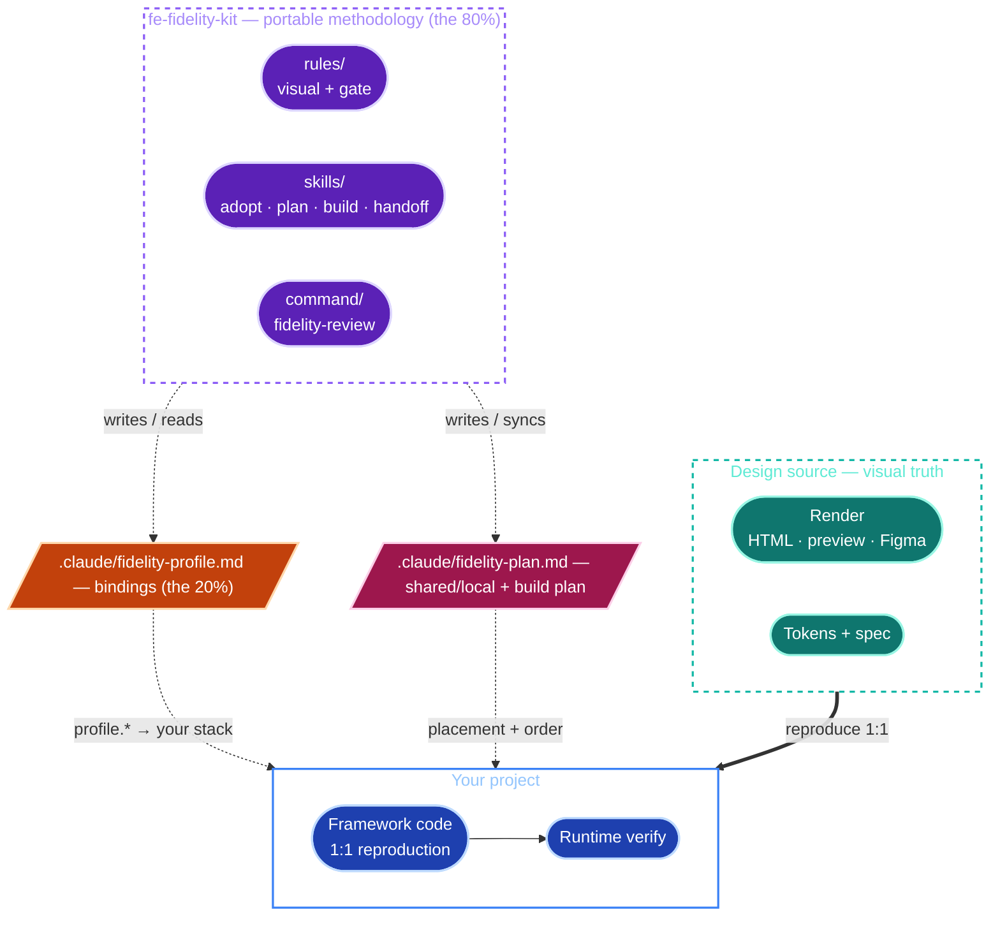
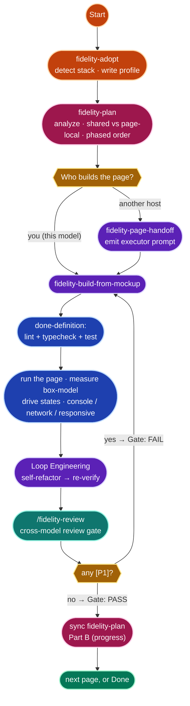

<div align="center">

# fe-fidelity-kit

**把设计稿（mockup）按 1:1 还原成前端代码 —— 并由「跨模型 executor/reviewer 评审」把关。**

一套面向 [Claude Code](https://claude.com/claude-code)（以及任意 Claude Agent SDK host）的**技术栈中立**工具包。*方法论*是可移植的；*每个项目的具体绑定*集中在一个文件里。

[English](README.md) · `简体中文`


</div>

---

## 这是什么

把 mockup 还原成真实前端代码时，「看起来做完了」往往远早于「真的做完了」。最后一公里 —— 图标、字体、精确的 box-model、hover 状态 —— 正是 1:1 fidelity 悄悄失守的地方，而单张截图根本抓不到。

**fe-fidelity-kit** 把一套还原方法论抽象出来：其中 **~80% 与框架无关**，把 **~20% 与技术栈相关的部分**（framework、UI lib、styling、icons、token 来源、路径、命令、运行时工具、mockup 来源）全部收进**单个 per-project profile**。你只需 adopt 一次，对照一份有纪律的清单还原页面，并且只交付能通过**跨模型评审 gate** 的产物。

可移植的 80%，一句话概括：

> *渲染结果才是 visual truth（不是 spec 文本）· native-component 优先 · token 按**值**映射而非按**名**映射 · 五个灾难区（icons / fonts / generated-visuals / container box-model / interactive states）· box-model 要**量**，不要靠眼睛估 · 组件按 AHA 放置 · executor×reviewer gate，`[P1]/[P2]` → `PASS/FAIL`。*

---

## 目录

- [三个核心理念](#三个核心理念)
- [架构](#架构)
- [工作流](#工作流)
- [构建计划](#构建计划)
- [评审 gate](#评审-gate)
- [五个灾难区](#五个灾难区)
- [快速上手](#快速上手)
- [包含哪些东西](#包含哪些东西)
- [Profile —— 那 20%](#profile--那-20)
- [Memory / Harness Interop](#memory--harness-interop)
- [能力阶梯](#能力阶梯)
- [会给 gate 设上限的情况](#会给-gate-设上限的情况)
- [它如何同时做到可移植与具体](#它如何同时做到可移植与具体)
- [FAQ](#faq)
- [贡献](#贡献)
- [许可证](#许可证)

---

## 三个核心理念

1. **渲染结果才是 visual truth —— 不是 spec 文本。** 还原最常见的翻车方式，就是只读 ticket 然后*脑补*结果。要打开真正的 render 去看；当 spec 与 render 冲突时，**render 为准**。
2. **80% 可移植方法论，20% per-project 绑定。** 纪律在项目之间从不改变，变的是技术栈。所以 kit 把纪律保持 stack-neutral，并把每一个具体名字（framework、UI lib、icon 包、token 文件、运行命令……）都限制在 `.claude/fidelity-profile.md` 里。
3. **一个模型来写，另一个**不同的**模型来评审。** 一个模型评审自己的产出，会共享它自己的盲区；跨模型评审的盲区互不重叠 —— gate 的价值正来自于此。结论是机器可解析的：`[P1]`（必须修 → FAIL）/ `[P2]`（建议）→ `Gate: PASS | FAIL`。

---

## 架构

kit 是一套 **stack-neutral 的方法论**（rules + skills + 一个 command），它**通过一个 profile 文件绑定到你的项目**。一侧是作为 visual truth 的设计源，另一侧是作为还原结果的你的项目，profile 则是把每一个泛化的 `profile.*` 引用解析到你真实技术栈的那座桥。



因为方法论文件从不写死技术栈 —— 它们引用 `profile.<field>`，并在运行时对照 `.claude/fidelity-profile.md` 解析 —— 同一套 kit 对 Next + AntD、Vite + Tailwind + Radix、Remix、Astro、Nuxt 或你带来的任何栈都适用。

---

## 工作流

**adopt 一次、plan 一次，然后对每个页面：还原 → 验证 → gate。** 你可以自己构建页面（模型即 executor），也可以把它交给一个*不同的* host（例如 Codex）由你来编排。



| 阶段 | Skill / command | 发生了什么 |
|---|---|---|
| **Adopt** | `fidelity-adopt` | 探测你的技术栈（framework、UI lib、styling、icons、token 来源、放置目录、mockup 位置、运行时工具），只问缺口，写出 `.claude/fidelity-profile.md` + 在 `CLAUDE.md` 里写一个幂等指针。非破坏性、可重跑。 |
| **Plan** | `fidelity-plan` | *(多页)* 普查整个 mockup → 设计模式、**shared vs page-local** 组件清单、分阶段构建顺序 → `.claude/fidelity-plan.md`，并带一个 living 进度追踪。 |
| **还原（你来）** | `fidelity-build-from-mockup` | 你就是 executor：拉取源、看 render、映射 native 组件、走完五个灾难区、按 AHA 放置，然后跑 done-definition。 |
| **还原（交出去）** | `fidelity-page-handoff` | 生成一段可直接粘贴的 prompt，把页面交给另一个 model/host 作为 executor —— 其中 spec 片段、done-definition、Loop Engineering 与 gate 握手都已预填。 |
| **验证** | *(executor)* | `lint + typecheck + test` 全绿，然后**真的把页面跑起来**：load + 截图、量 box-model、驱动 interactive states、检查 console/network/responsive。保留证据。 |
| **Loop Engineering** | *(executor)* | 一轮自重构，收敛到最简形态 —— 行为与渲染结果不得改变 —— 然后重跑整套 done-definition。 |
| **Gate** | `/fidelity-review` *(或 `fidelity-page-handoff` 模板 C → 另一个 host)* | 一个只读的 reviewer（最好是不同模型）审查 diff + 证据，给出 `[P1]/[P2]` → `Gate: PASS | FAIL`。 |

---

## 构建计划

对于多页 mockup，**`fidelity-plan` 在构建任何页面之前先跑一次。** 它普查*整个* mockup 并写出 `.claude/fidelity-plan.md`：

- **设计模式** —— 反复出现的 shell、区块、交互；哪些映射到 native 组件，哪些是真正手写的。
- **shared vs page-local 组件** —— 每个反复出现的组件按其**实际跨页使用**分类：用于 ≥2 个页面（或守护一个 cross-module invariant）→ **shared**；只用一次 → **page-local**。这是用*普查*实施的 AHA（Avoid Hasty Abstractions）—— 第 N 次使用是被*探测*出来的、而非臆测 —— 所以既不会重复造近似组件，也不会把单页组件提前公共化。
- **分阶段构建顺序** —— 工程底座 → app shell + 全局 shared 基件 → 页面，*把共享同一组件的页面分到同一阶段*，让那个 shared 件只收敛一次。
- **living 进度追踪** —— 每个页面过 gate 后，构建循环更新页面/组件状态、真实验证记录、下一刀；当某 page-local 组件出现真实的第 2 次使用时即提升为 shared。计划与代码的漂移会被 `/fidelity-review` 标记。

只有单页或一次性页面？跳过它，直接用 `fidelity-build-from-mockup`。

---

## 评审 gate

这是 kit 的核心。**一个模型写，另一个模型挑刺。** executor 负责一切静态评审*看不到*的东西（能跑起来吗？会溢出吗？box-model 的数字对吗？）；reviewer 负责构建者在自己的产出里会盲掉的东西。

```mermaid
flowchart LR
    classDef exec fill:#5b21b6,stroke:#ddd6fe,stroke-width:2px,color:#fff
    classDef rev fill:#0f766e,stroke:#99f6e4,stroke-width:2px,color:#fff
    classDef decision fill:#a16207,stroke:#fde68a,stroke-width:2px,color:#fff
    classDef success fill:#047857,stroke:#a7f3d0,stroke-width:2px,color:#fff
    classDef fail fill:#b91c1c,stroke:#fecaca,stroke-width:2px,color:#fff

    subgraph Exec["Executor — writes code · runs the page"]
        direction TB
        E1(["build the page"]):::exec --> E2(["run it · capture evidence<br/>screenshots · box-model · console"]):::exec --> E3(["Loop Engineering"]):::exec
    end

    subgraph Rev["Reviewer — read-only · a different model"]
        direction TB
        R1(["audit diff + evidence"]):::rev --> R2(["tag findings<br/>[P1] must-fix · [P2] suggest"]):::rev
    end

    E3 ==>|"submit diff + evidence"| R1
    R2 --> D{{"any [P1]?"}}:::decision
    D -->|"no"| Pass(["Gate: PASS → merge"]):::success
    D -->|"yes"| Fail(["Gate: FAIL<br/>→ back to executor"]):::fail

    style Exec fill:none,stroke:#8b5cf6,stroke-width:2px,stroke-dasharray:5 5,color:#a78bfa
    style Rev fill:none,stroke:#14b8a6,stroke-width:2px,stroke-dasharray:5 5,color:#5eead4
```



| | **Executor** | **Reviewer** |
|---|---|---|
| 谁 | 写代码的那个 model/host（Claude、Codex 或任意） | 一个**不同的** model/host，只读 |
| 负责 | 写代码；跑 lint/typecheck/test；**把页面跑起来**；量 box-model、驱动 states、检查 console/network/responsive；附上证据 | 审 diff、行为风险、edge/failure 路径、测试薄弱处；对 UI，从代码 + executor 的截图审 style-match 信号；给出结论 |
| **不**负责 | 自己裁定 gate 结论 | 跑页面或改代码 |

executor 的证据不是零散截图 —— 它遵循一套命名契约（`<route>-<state>-<viewport>.png`、`<route>-box.txt`、`<route>-console.txt`），都放在 `profile.verify.evidence_dir` 下，这样 reviewer 的一条结论就能像代码引用 `file:line` 那样引用某个文件。见 [`fidelity-gate.md`](rules/fidelity-gate.md)。

**结论规则**

- `[P1]` = **必须修 → FAIL。** spec/行为漂移、被吞掉的错误、缺失的 edge 路径、同义反复的测试、破坏的接口、竞态 —— **以及破坏当前 UI 目标的视觉漂移**（icon set 被换、heading 字体回退到系统字体、generated-visual 结构不对、box-model 漂移）。
- `[P2]` = **建议 → follow-up。** 不阻塞 —— *除非*它破坏了当前 UI 目标，那就提升为 `[P1]`。
- **没有 `[P1]` ⇒ PASS。** 报告以恰好两行机器可解析的结尾收束：
  ```
  Gate: PASS | FAIL
  Recommendation: <一个具体动作> because <最重要的那条 finding>
  ```

> **reviewer 给 PASS 从不等于「页面渲染正确」。** 运行时的 layout/overflow/console/box-model 是 executor 的职责，且是 PASS 的*前提* —— 关于 single-model / 无法测量 / 无法驱动状态等降级，见[设上限的情况](#会给-gate-设上限的情况)。

> **是实测，不是口号。** 一次 dogfood 里，单模型 two-pass 给复刻好的落地页判了 `Gate: PASS` —— 它自己的 box-model 证据是 18/18。把*同一份* reviewer 契约交给另一个厂商的模型（Codex），却判了 `Gate: FAIL`：一个共享按钮组件给每个变体都加了 1px 边，而 mockup 是 `border:none` —— 约 2px 的 box-model 漂移，因边框透明而肉眼不可见。盲点就在 executor *自己*的证据里（它从没量过按钮边），所以同模型的第二遍继承了它；换个模型从代码读起，把它抓成了 `[P1]`。修复后，同一个跨模型 reviewer 判了 `Gate: PASS`。这就是「盲点不重叠」—— 发生在一个真实缺陷上。

---

## 五个灾难区

这些是 1:1 还原失守的地方。Zone 1–3 是「换错了东西」；Zone 4 是「看着对，其实差 4–8px」（最阴险）；Zone 5 是「看着对，行为错了」（在单张静态截图里看不见）。

| # | 灾难区 | 陷阱 | 纪律 |
|---|---|---|---|
| **Z1** | **Icons** | 换成另一套 icon 家族 —— 不同的字形几何永远对不齐。 | 用**源**的 icon set。同一套 → 算法化 id 映射（`kebab→Pascal`）。不同套 → 记录一张查找表。UI 库自带的内置字形（Select 箭头、Modal ✕）保持 native。 |
| **Z2** | **Fonts** | 用裸 `<div style={{fontSize}}>` 设标题，会回退到系统字体，看起来「完全不一样」。 | 标题通过 **type ramp / 语义访问器**渲染，让它继承字阶 —— 绝不手设 px。 |
| **Z3** | **Generated visuals** *（charts/sparklines/gauges —— 仅当存在时）* | 直接用图表库默认值；加上 mockup 没有的标签；改了配色。 | 还原 mockup 的**结构 + token 配色**；把库调到恰好等于 mockup 展示的样子。不要多加。 |
| **Z4** | **Container box-model** ★ | 从截图估 padding；把 inline 文本改成 `flex; gap`（凭空多 4px）；按**名**而非按**值**绑 token（`--radius-md: 8px` → 应绑*值为 8* 的 token，而不是仅仅名字叫 "md" 的那个）。 | **量，别看。** grep 源 CSS，逐字段拷 `padding/gap/border/radius/line-height`，把 color/radius/shadow 映射到**值相等**的 token，spacing 写精确 px，并拷贝 DOM 结构。 |
| **Z5** | **Interactive states** | 单张默认态截图会藏住 hover/focus/active/disabled/transition/overlay-z。 | 按源的规则还原每个状态，并通过在运行时工具里**驱动**该状态来验证 —— 而不是静止态截图。 |

---

## 快速上手

> 下面每条命令里，`<kit-dir>` = 本 kit 的路径（这个 README 所在的目录），`<project>` = 你的目标项目。

### 1 · 安装（任选其一）

<details open>
<summary><b>A. 插件，仅本次会话</b> —— 最快试用</summary>

```bash
claude --plugin-dir <kit-dir>
```
skills/commands 以命名空间形式出现：`/fe-fidelity-kit:fidelity-review`、`fidelity-build-from-mockup` skill 等。
</details>

<details>
<summary><b>B. 插件，经由 marketplace</b> —— 团队分发</summary>

```bash
claude plugin marketplace add https://github.com/AliceDel66/fe-fidelity-kit   # 团队：指向 kit 的 git remote（推荐）
# 或仅同机：  claude plugin marketplace add <kit-dir>
claude plugin install fe-fidelity-kit@fe-fidelity-kit
```
</details>

<details>
<summary><b>C. 直接放进项目的 <code>.claude/</code></b> —— 不走插件机制</summary>

把 kit 作为一个整体拷过去（skills 与 rules 之间的交叉引用是相对路径 —— 拷一半会断；`kit-manifest.json` 一并带上，`fidelity-adopt --verify` 才能自检这次拷贝）：
```bash
cp -R <kit-dir>/{skills,commands,rules,profile,references,kit-manifest.json} <project>/.claude/
```
此时 skills/commands 无命名空间：`/fidelity-review` 等。每个 kit skill 与 command 都带 `fidelity-` 前缀（`fidelity-adopt`、`fidelity-build-from-mockup`、`fidelity-page-handoff`、`fidelity-review`），不会盖住项目自己的 `code-review` / `build`。
</details>

### 2 · Adopt、plan、还原、gate

```text
1. 在你的项目里运行  fidelity-adopt  skill   → 写出 .claude/fidelity-profile.md
2. 规划构建（多页 mockup）                    → fidelity-plan  skill → .claude/fidelity-plan.md
3. 还原一个页面：
     • 自己来          → fidelity-build-from-mockup  skill
     • 交给别的 host   → fidelity-page-handoff  skill（把 prompt 粘给 Codex 等）
4. 把关：  /fidelity-review   → 必须是  Gate: PASS（无 [P1]）  → 然后同步计划
```

---

## 包含哪些东西

| 组成 | 作用 |
|---|---|
| [`skills/fidelity-adopt`](skills/fidelity-adopt/SKILL.md) | **先跑这个。** 探测技术栈，只问缺口，写出 `.claude/fidelity-profile.md`。非破坏性、可重跑。 |
| [`skills/fidelity-plan`](skills/fidelity-plan/SKILL.md) | **第二个跑（多页）。** 普查整个 mockup → 设计模式、**shared vs page-local** 组件清单、分阶段构建顺序 → `.claude/fidelity-plan.md` + 构建循环同步的 living 进度追踪。 |
| [`skills/fidelity-build-from-mockup`](skills/fidelity-build-from-mockup/SKILL.md) | 还原循环 —— *你*来构建页面（native 优先、token 按值、五个灾难区、量化验证、Loop Engineering，然后 gate）。 |
| [`skills/fidelity-page-handoff`](skills/fidelity-page-handoff/SKILL.md) | 生成可直接粘贴的 prompt，把页面交给一个**不同的** model/host（例如 Codex）—— 作为 **executor**（构建/修复，模板 A/B）或只读 **reviewer**（跑 gate，模板 C）。 |
| [`commands/fidelity-review`](commands/fidelity-review.md) | gate 中 reviewer 的那一半：`/fidelity-review` → `[P1]/[P2]` + `Gate: PASS\|FAIL`。 |
| [`rules/fidelity-visual.md`](rules/fidelity-visual.md) | stack-neutral 的 fidelity 纪律（五个灾难区、token 按值、box-model 量化、AHA）。 |
| [`rules/fidelity-gate.md`](rules/fidelity-gate.md) | stack-neutral 的 executor×reviewer 协议（证据契约、runtime≠static 边界、single-model 兜底）。 |
| [`profile/`](profile/) | profile 模板 + 三个填好的范例（Next/AntD；Vite/Tailwind/Radix；Nuxt/Vue/Nuxt UI）。 |
| [`references/memory-harness-interop.md`](references/memory-harness-interop.md) | 可选桥接层：bounded memory reuse packet 与 repo-harness artifact 映射。 |
| [`kit-manifest.json`](kit-manifest.json) | 自检清单 —— `fidelity-adopt --verify` 断言目录存在且交叉引用可解析（用于抓出拷一半的 drop-in）。 |

---

## Profile —— 那 20%

所有与技术栈相关的东西都在 `.claude/fidelity-profile.md` 里（项目本地，由 `fidelity-adopt` 写出）。方法论文件引用 `profile.token_sot`、`profile.icon_lib`、`profile.verify.recipe.box` 这样的字段，并在运行时对照该文件解析。

**引用约定：** 一个*有辨识度*的叶子直接裸写（`profile.token_sot`、`profile.ui_lib`、`profile.page_components_pattern`）；一个*泛化*的叶子保留它的 section 前缀（`profile.commands.lint`、`profile.verify.recipe.box`、`profile.mockup.styles`、`profile.gate.reviewer_host`）。

profile 携带：`stack`（framework / ui_lib / styling / icon_lib / chart_lib / copy_language / i18n）、`paths`（import alias、token source-of-truth、token 访问器、放置目录、AHA 阈值）、可选 `context`（memory backend、harness backend、bounded reuse-packet 策略）、`mockup`（render + kind + styles + tokens + spec + dialect）、`commands`（install/dev/lint/typecheck/test/build）、`verify`（运行时工具、`measure_capable`、viewports、一份 per-stack 的测量 recipe）、以及 `gate`（reviewer host、报告路径）。外加几张会生长的 markdown 表：**Component map**（源 dialect → 目标 native，首次用到时生长）、**Icon map**、**Token traps**。

随包附带三个填好的范例，既作填写示范也作可移植性证明：

- [`profile/examples/nexus-pro-fe.profile.md`](profile/examples/nexus-pro-fe.profile.md) —— Next 16 + AntD v6 + emotion/antd-style + lucide-react。
- [`profile/examples/react-tailwind-radix-vite.profile.md`](profile/examples/react-tailwind-radix-vite.profile.md) —— Vite + React + Tailwind + Radix（证明 kit 并非围着 AntD 设计；并暴露 *same-dialect collapse* 与 *figma-inspect* 两类边界）。
- [`profile/examples/nuxt-vue-nuxtui.profile.md`](profile/examples/nuxt-vue-nuxtui.profile.md) —— Nuxt 3 + Vue + Nuxt UI（证明 kit 并非围着 *React* 设计；并暴露 *cross-paradigm 组件映射* 与 *Iconify 字符串名* 图标范式 `i-lucide-*`）。

---

## Memory / Harness Interop

Memory 与 repo-harness 支持都是可选的。当 `profile.context.memory_backend` 是 `claude-mem`、`codex-memory`、`repo-harness` 或 `custom` 时，skills 可以生成一份 bounded **reuse packet**：最多 3-5 条历史陷阱、旧 `[P1]` 失败或需要复核的 evidence 路径。这份 packet 只做提示；当前 render、代码、profile 与 runtime evidence 永远优先。

当 `profile.context.harness_backend` 是 `repo-harness` 时，`/fidelity-review` 可以在已有 repo-local harness review/check/handoff artifact 中暴露同一份 gate report。它仍以 `profile.gate.report_path` 为 canonical report，保留精确的 `Gate:` 结尾，并且不会把 repo-harness 变成硬依赖。

没有 backend 时流程不变：`context.memory_backend: "none"` 与 `context.harness_backend: "none"` 会静默跳过桥接层。

---

## 能力阶梯

你的验证能有多强 —— 进而 gate 能有多强 —— 取决于设计源到底*是什么*：

| `render_kind` | 源是… | box-model 可测量？ | gate 上限 |
|---|---|---|---|
| `static-html` / `preview-url` / `storybook` | 可在浏览器里加载 | ✅ 完整 —— 两侧都能 `getComputedStyle` | 可拿干净的 `PASS` |
| `figma-inspect` | 可检视，但非 live DOM | ⚠️ 源侧靠 Figma inspect 手测，目标侧用工具测 | `PASS`，并标注源侧不确定性 |
| `screenshots` | 只有像素 | ❌ 降级 —— 只能测目标，源靠眼睛估 | 封顶为 `PASS (visual-only — box-model UNVERIFIED)` |

---

## 会给 gate 设上限的情况

- **只有一个模型可用？** 没有第二个 host 时，gate 降级为**同模型两遍**：构建 → 清空上下文 / 新会话 → 以 Reviewer 身份审 diff。在独立性上明确更弱，但证据契约与 `[P1]/[P2]` + `Gate:` 结论都保留。报告头部标注 `degraded: single-model two-pass`。
- **运行时工具无法测量？** 若 `profile.verify.measure_capable: false`（只能截图、只有 Figma、或根本没浏览器），executor 无法满足「量而非估」。此时能拿到的最好结论是 `Gate: PASS (visual-only — box-model UNVERIFIED)` —— **永远不是干净的 PASS** —— 且 `fidelity-adopt` 会提示你装一个有测量能力的工具（headless-browser skill / Playwright）。
- **运行时工具无法驱动状态？** 若 `profile.verify.state_drivable: false`（预览只能截静止 DOM，无法触发 `:hover` / `:focus` / `:active` / 打开），Zone-5 交互态无法被驱动。executor 从源的规则复刻这些状态、reviewer 在代码里确认状态 class/handler 已写，但结论带上 `interaction UNDRIVEN` —— 对有状态的 UI 永远不是干净的 PASS。`measure_capable` 与 `state_drivable` 正交：任一为 false 都各自封顶，且可叠加。

---

## 它如何同时做到可移植与具体

- **一棵路径不变的树。** 同一个文件夹既是 plugin 根，又是 `.claude/` drop-in 内容。交叉引用都相对于引用方文件书写（skill 里用 `../../rules/…`，command 里用 `../rules/…`），因此在两种布局下都能解析。共享文件从不使用 `${CLAUDE_PLUGIN_ROOT}`（那是 plugin 专属）。
- **所有绑定集中在一个文件。** 方法论文件引用 `profile.<field>`；填好的 profile 位于 `<project>/.claude/fidelity-profile.md` —— 绝不在共享 kit 里。
- **「具体」是一条交付铁律。** rules 里每条原则都带一个标注为 *(illustrative, reference stack)* 的实例，外加一个 `profile.<field>` 填空形式。那些尖锐的坑（`--radius-md:8 → 不是那个值为 6 的 token` 陷阱、差 4–8px 的容器、「别把 inline 文本改成 flex+gap」）都**逐字保留** —— 泛化不能把它们磨平。

---

## FAQ

**它会把我锁死在某个框架 / UI 库上吗？**
不会 —— 这正是重点。方法论是 stack-neutral 的，你的技术栈活在 profile 里。随包的范例特意横跨 React（AntD、Tailwind/Radix）与 Vue（Nuxt UI）。

**我必须有两个不同的模型吗？**
不必，但那是最强模式。只有一个模型时，gate 降级为新上下文两遍（见[设上限的情况](#会给-gate-设上限的情况)）。

**如果我的设计源只有截图 / Figma 呢？**
仍然能用，只是上限更低 —— 见[能力阶梯](#能力阶梯)。gate 会诚实地封顶，而不是造假。

**reviewer 能改我的代码吗？**
不能。`fidelity-review` 只读，唯一的写是报告文件。修 `[P1]` 是 executor 的活。

**它会往我意料之外的地方写东西吗？**
`fidelity-adopt` 只写 `.claude/fidelity-profile.md`（若已存在则写 `.review.md`）以及 `CLAUDE.md` 里一个幂等的标记块。它拒绝覆盖已有 profile，也从不碰源码、配置或 lockfile。

---

## 贡献

欢迎 issue 与 PR。kit 刻意保持小而有主见。重要变更记录在 [CHANGELOG.md](CHANGELOG.md)。改动的门槛：

- 保持 rules **stack-neutral** —— 具体名字属于 `profile.<field>`，不属于 `rules/` 或 `skills/`。
- 保留那些**尖锐的坑**（具名陷阱、精确 px、逐字 gotcha）。泛化不得把它们磨钝。
- 维持**路径不变**的布局（相对交叉引用；共享文件不用 `${CLAUDE_PLUGIN_ROOT}`）。
- 改完结构后跑一次 `node scripts/verify-kit.mjs` —— 它会自检 manifest 目录、相对交叉引用、**profile 字段契约**（rules/skills/commands/references 引用的每个 `profile.*` 都在模板里有定义）、context backend 枚举、双语标题对称性、示例里没有残留的 `FILL:`，以及每个示例都填齐模板的每个字段（字段契约双向校验）。它对 CI 友好（失败时返回非零退出码）。*（已采纳 kit 的项目改用 `fidelity-adopt --verify`——那个需要一份填好的 profile；这个校验的是 kit 仓库自身。）*

---

## 许可证

基于 [MIT License](LICENSE) 发布。

<div align="center">
<sub>为 <a href="https://claude.com/claude-code">Claude Code</a> 打造 · 方法论可移植，绑定按项目。</sub>
</div>
